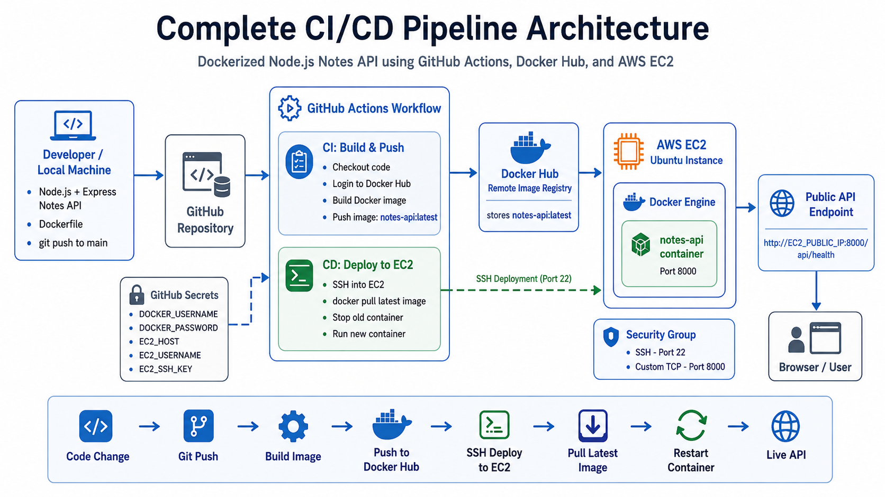

# Automated CI/CD Pipeline with GitHub Actions, Docker Hub, and AWS EC2


<!-- Replace the URL above with your actual image link -->


---

## 📝 Description

This project is a simple **Node.js and Express Notes API** built as my first hands-on experience with a complete CI/CD pipeline.

The application is containerized using **Docker**, the Docker image is pushed to **Docker Hub**, and the deployment is automated using **GitHub Actions** to run the latest container on an **AWS EC2 Ubuntu instance**.

---

## 🛠️ Tech Stack

| Category | Technology |
|----------|------------|
| **Backend** | Node.js, Express.js |
| **Containerization** | Docker |
| **Registry** | Docker Hub |
| **CI/CD** | GitHub Actions |
| **Cloud Hosting** | AWS EC2 (Ubuntu) |
| **Remote Access** | SSH |

---

## 📋 Project Overview

The API includes simple endpoints such as:

```txt
GET /
GET /api/health
GET /api/notes
POST /api/notes
DELETE /api/notes/:id