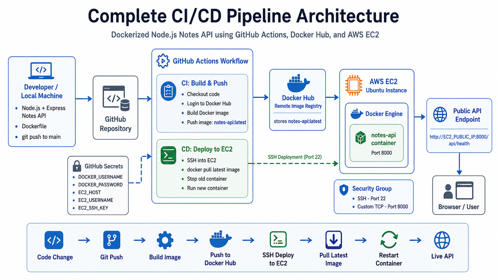

# 🚀 Automated CI/CD Pipeline with GitHub Actions, Docker Hub & AWS EC2

<p align="center">
  
</p>

<p align="center">
  <strong>A hands-on DevOps project demonstrating automated application deployment using GitHub Actions, Docker, Docker Hub, and Amazon EC2.</strong>
</p>

<p align="center">
  
  
  
  
  
</p>

---

## 📌 Project Overview

This project is a simple **Node.js and Express.js Notes API** created to gain practical experience with an end-to-end **CI/CD workflow**.

The main focus of the project is not the complexity of the API, but the process of automatically taking application source code from a GitHub repository, building a Docker image, publishing the image to Docker Hub, and deploying the latest version to an **AWS EC2 Ubuntu instance**.

The complete workflow is:

```text
Developer
    │
    ▼
GitHub Repository
    │
    │ Push
    ▼
GitHub Actions
    │
    ├── Install Dependencies
    ├── Run Tests
    ├── Build Docker Image
    ├── Push Image
    │
    ▼
Docker Hub
    │
    │ Pull Latest Image
    ▼
AWS EC2
    │
    ▼
Docker Container
    │
    ▼
Notes API
